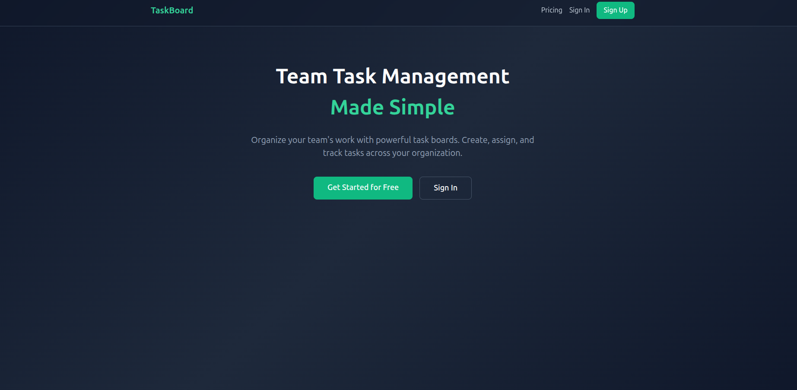
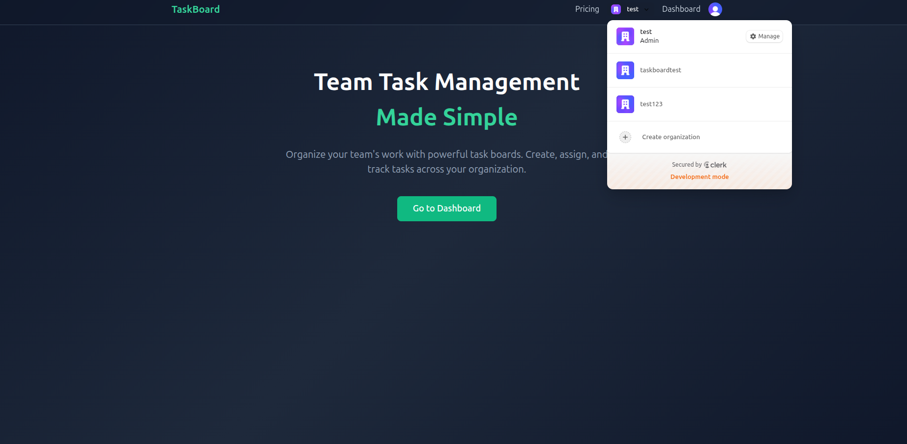
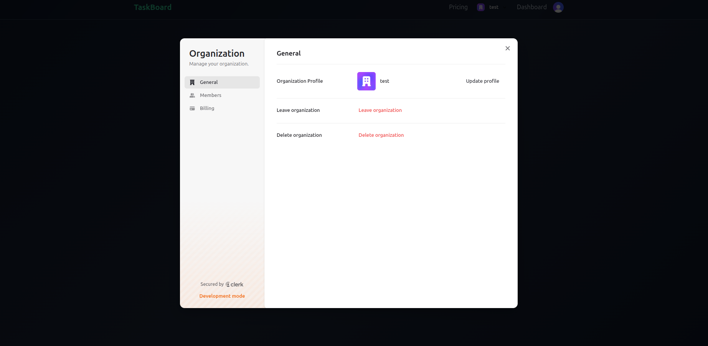
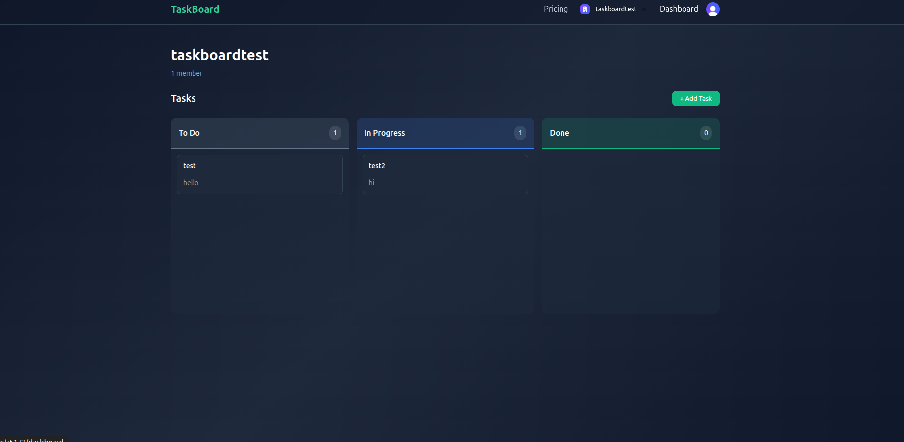

# TaskBoard - Team Task Management SaaS

A modern, full-stack B2B task management application built with React and FastAPI. Organize your team's work with powerful kanban boards, role-based permissions, and subscription management.

## 📸 Screenshots

### Home Page


### Organization Switcher


### Kanban Dashboard


### Subscription Plans


### Organization Settings


## 🚀 Features

### Task Management
- **Kanban Board** - Visual task organization with three columns (To Do, In Progress, Done)
- **CRUD Operations** - Create, read, update, and delete tasks
- **Task Details** - Add titles, descriptions, and status to each task
- **Real-time Updates** - Optimistic UI updates for smooth user experience

### Authentication & Authorization
- **Clerk Integration** - Secure authentication with email/password and social logins
- **Organization-based** - Multi-tenant architecture with organization isolation
- **Role-based Permissions** - Admins and editors can manage tasks, viewers can only see them
- **Protected Routes** - Automatic redirect for unauthenticated users

### Subscription Management
- **Free Tier** - Up to 2 members per organization
- **Pro Tier** - Unlimited members
- **Automatic Limits** - Member limits adjust automatically based on subscription
- **Webhook Integration** - Real-time subscription updates via Clerk webhooks

### User Experience
- **Modern Dark UI** - Beautiful gradient background with smooth animations
- **Responsive Design** - Works on desktop and mobile devices
- **Intuitive Navigation** - Clean layout with easy-to-use interface
- **Modal Forms** - Smooth task creation and editing experience

## 🛠️ Tech Stack

### Frontend
- **React 19** - Modern UI library
- **Vite** - Fast build tool and dev server
- **React Router** - Client-side routing
- **Clerk React** - Authentication components
- **Custom CSS** - No UI framework, fully custom styling

### Backend
- **FastAPI** - High-performance Python web framework
- **SQLAlchemy** - SQL toolkit and ORM
- **SQLite** - Lightweight database (easily swappable)
- **Clerk Backend SDK** - JWT verification and user management
- **Svix** - Webhook signature verification
- **Uvicorn** - ASGI server

## 📋 Prerequisites

- **Python 3.13+**
- **Node.js 18+** and npm
- **Clerk Account** - [Sign up for free](https://clerk.com)
- **Git**

## 🔧 Installation & Setup

### 1. Clone the Repository

```bash
git clone https://github.com/Timos90/TaskBoard.git
cd TaskBoard
```

### 2. Backend Setup

```bash
cd backend

# Create virtual environment
python -m venv .venv
source .venv/bin/activate  # On Windows: .venv\Scripts\activate

# Install dependencies
pip install -r requirements.txt
# OR if using uv:
uv sync

# Create .env file
cp .env.example .env
```

Edit `backend/.env` with your Clerk credentials:

```env
CLERK_SECRET_KEY=your_clerk_secret_key
CLERK_PUBLISHABLE_KEY=your_clerk_publishable_key
CLERK_JWKS_URL=https://your-instance.clerk.accounts.dev/.well-known/jwks.json
CLERK_WEBHOOK_SECRET=your_webhook_secret

DATABASE_URL=sqlite:///./taskboard.db
FRONTEND_URL=http://localhost:5173
```

### 3. Frontend Setup

```bash
cd ../frontend

# Install dependencies
npm install

# Create .env file
cp .env.example .env
```

Edit `frontend/.env` with your Clerk publishable key:

```env
VITE_CLERK_PUBLISHABLE_KEY=your_clerk_publishable_key
VITE_API_URL=http://localhost:8000
```

### 4. Configure Clerk

1. Go to [Clerk Dashboard](https://dashboard.clerk.com)
2. Create a new application
3. Enable **Organizations** feature
4. Set up **Permissions**:
   - `org:tasks:view` - View tasks
   - `org:tasks:create` - Create tasks
   - `org:tasks:edit` - Edit tasks
   - `org:tasks:delete` - Delete tasks
5. Assign permissions to roles:
   - **Admin**: All permissions
   - **Editor**: view, create, edit, delete
   - **Viewer**: view only

### 5. Set Up Webhooks (Optional for Subscriptions)

1. In Clerk Dashboard, go to **Webhooks**
2. Add endpoint: `https://your-domain.com/api/webhooks/clerk`
3. Subscribe to events:
   - `subscription.created`
   - `subscription.updated`
   - `subscription.deleted`
   - `subscription.cancelled`
4. Copy the webhook secret to your `.env` file

For local development, use [ngrok](https://ngrok.com):
```bash
ngrok http 8000
# Use the ngrok URL in Clerk webhook settings
```

## 🚀 Running the Application

### Start Backend Server

```bash
cd backend
python start.py
# Server runs on http://localhost:8000
```

### Start Frontend Development Server

```bash
cd frontend
npm run dev
# App runs on http://localhost:5173
```

## 📖 How to Use

### Getting Started

1. **Sign Up** - Create an account at `http://localhost:5173/sign-up`
2. **Create Organization** - You'll be prompted to create or join an organization
3. **Access Dashboard** - Navigate to the dashboard to see your kanban board

### Managing Tasks

#### Create a Task
1. Click the **"+ Add Task"** button (admins/editors only)
2. Fill in the title (required), description (optional), and status
3. Click **"Create Task"**

#### Edit a Task
1. Click on any task card
2. Modify the details in the modal
3. Click **"Save Changes"**

#### Delete a Task
1. Hover over a task card
2. Click the **"X"** button that appears
3. Confirm deletion

#### Move Tasks
- Tasks are organized in three columns:
  - **To Do** - Pending tasks
  - **In Progress** - Started tasks
  - **Done** - Completed tasks
- Edit a task and change its status to move it between columns

### Managing Your Organization

#### Invite Members
1. Click the organization switcher in the navigation
2. Go to **"Manage organization"**
3. Invite members via email
4. Assign roles (Admin, Editor, or Viewer)

#### Upgrade Subscription
1. Go to **Pricing** page
2. Click **"Upgrade to Pro"** (admins only)
3. Complete payment through Clerk's pricing table
4. Member limit automatically increases to unlimited

### Permissions

| Action | Admin | Editor | Viewer |
|--------|-------|--------|--------|
| View tasks | ✅ | ✅ | ✅ |
| Create tasks | ✅ | ✅ | ❌ |
| Edit tasks | ✅ | ✅ | ❌ |
| Delete tasks | ✅ | ✅ | ❌ |
| Manage subscription | ✅ | ❌ | ❌ |
| Invite members | ✅ | ❌ | ❌ |

## 🏗️ Project Structure

```
TaskBoard/
├── backend/
│   ├── app/
│   │   ├── api/
│   │   │   ├── tasks.py          # Task CRUD endpoints
│   │   │   └── webhooks.py       # Clerk webhook handlers
│   │   ├── core/
│   │   │   ├── auth.py           # Authentication logic
│   │   │   ├── clerk.py          # Clerk SDK instance
│   │   │   ├── config.py         # Configuration
│   │   │   └── database.py       # Database setup
│   │   ├── models/
│   │   │   └── task.py           # Task database model
│   │   └── schemas/
│   │       └── task.py           # Pydantic schemas
│   ├── main.py                   # FastAPI app
│   ├── start.py                  # Server startup
│   └── pyproject.toml            # Python dependencies
│
├── frontend/
│   ├── src/
│   │   ├── components/
│   │   │   ├── KanbanBoard.jsx   # Main kanban board
│   │   │   ├── TaskColumn.jsx    # Column component
│   │   │   ├── TaskCard.jsx      # Task card component
│   │   │   ├── TaskForm.jsx      # Create/edit modal
│   │   │   └── Layout.jsx        # App layout & navigation
│   │   ├── pages/
│   │   │   ├── HomePage.jsx      # Landing page
│   │   │   ├── DashboardPage.jsx # Main dashboard
│   │   │   ├── PricingPage.jsx   # Subscription management
│   │   │   ├── SignInPage.jsx    # Sign in
│   │   │   └── SignUpPage.jsx    # Sign up
│   │   ├── services/
│   │   │   └── api.js            # API client
│   │   ├── styles/               # CSS files
│   │   ├── App.jsx               # App routing
│   │   └── main.jsx              # Entry point
│   └── package.json              # Node dependencies
│
└── README.md
```

## 🔒 Security

- **JWT Authentication** - Secure token-based authentication via Clerk
- **Webhook Verification** - Svix signature verification for webhooks
- **Organization Isolation** - Users can only access their organization's data
- **Permission Checks** - Backend validates permissions on every request
- **Environment Variables** - Sensitive data stored in `.env` files (not committed)

